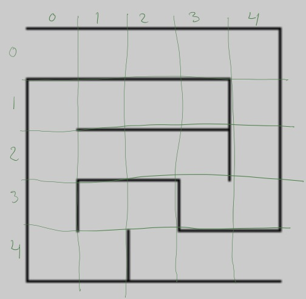

# Uge 4 - Graf algoritmer

Som sidst starter vi begyndelsen af sessionen til at samle op på opgaven fra sidst. 

## Forberedelse
Denne gang og næste gang kommer vi til at kikke på graf algoritmer. Der er flere ting man kikker på, men vi kommer til at kikke på dem der handler om at "finde vej".

Som forberedelse vil jeg bede jer læse noten:

* [Data Structure - Graph Data Structure](Data Structures and Algorithms Graph Data Structure.pdf) som er snuppet fra tutorialspoint.com.

## Læsestof
Ud over noten ovenfor, så kan man kikke i [denne for at grave dybere](Graph traversals.pdf) der stammer fra http://www.cs.cornell.edu/courses/cs2112/2012sp/lectures/lec24/lec24-12sp.html

På [denne side er der nogle interaktive animationer](https://visualgo.net/dfsbfs) af de to graf algoritmer vi vil se på - dybde først og bredde først. Læg mærke til at der oppe i øverste højre hjørne er en lille menu hvor du kan vælge mellem "Exploration mode" og "e-Lecture mode". Hvis du vælger e-lecture, så kommer der nogle pop up vinduer der gennemgår hvordan siden kan bruges.


## Øvelser på klassen
1. På siden <https://visualgo.net/dfsbfs> skal du vælge eksempel graf "CP3 4.17 DAG". Kør stille og roligt (jeg vil anbefale single step) DFS igennem, og tegn det træ der er resultatet. 
2. Kør samme graf igennem med BFS og sammenlign de to træer der kommer ud af det.
3. Lav en DFS på nedenstående mikro-labyrint
. 

Der er start i koordinat 0.0. Reelt sker der kun noget sjovt i koordinat 0,2. 

4. Er der forskel på det træ som en bredde først søgning ville lave?
5. Hvis der var åbent mellem (2,0) og (2,1) hvilke træer laver DFS of BFS?

## Øvelser til næste gang
Øvelsen til næste gang går ud på at lave en dybde først algoritme der finder vej i et labyrint.

### [Kode som blev lavet på klassen](https://github.com/cphbusinessAUVidrProg/uge4opgaveKoe)

Fra første uge har vi et stykke program der kan læse et labyrint fra en fil. Labyrinten er som dengang på formen:

```
21x21
+-+-+-+-+-+-+-+-+-+-+
B |   | |     |     |
+ + + + + +-+ + +-+ +
|   |     | | |   | |
+-+-+-+-+-+ + +-+ + +
|     |   | |   | | |
+ +-+ +-+ + + + + + +
| | |     |   |   | |
+ + + +-+-+-+-+ +-+ +
| | |     |   | |   |
+ + +-+-+ + + + + +-+
|   |   |   |   | | |
+-+-+ + +-+-+-+ + + +
|     |     |   |   |
+-+-+ +-+ +-+ + +-+-+
|     |       |   | |
+ +-+-+-+-+-+-+-+ + +
|         |     |   |
+-+-+-+-+ + +-+-+ +-+
|         |         E
+-+-+-+-+-+-+-+-+-+-+
```

Bemærk at:

* Der står B i punkt 0,1. De labyrinter der laves med [DJ Delorie's generator](http://www.delorie.com/game-room/mazes/genmaze.cgi) starter altid i (0,1) og slutter i nederste højre hjørne.
* Første linje (linje 0) har ingen blanke felter. 
* Der er forbindelse mellem to felter felter hvis de begge er 'blanke' (altså at det er mellemrums tegnet der er i feltet).

Dybde først algoritmen skal bruge nogle informationer for hvert felt F:

* Det skal være muligt at markere at hvilke felter der allerede er besøgt (visited). Jeg vil anbefale at man markerer besøgte felter med "." så man kan skrive labyrintet ud og se hvor den har besøgt.

* Det skal være muligt at finde de nabo felter der er åbne (har mellemrums tegn). Her kan jeg anbefale at man undersøger dem i en eller anden fast rækkefølge - f.eks. ovenover, tilhøjre, nedenunder og tilvenstre.

* Det skal være muligt at lave stakken som algoritmen benytter sig af. Det den har på stakken er de felter der allerede er en del af vores foreløbige sti. Felter er jo angivet med koordinater (søjle, række). Du får derfor brug for en lille hjælpe klasse "Felt" til at huske koordinater.

* Normalt slutter algoritmen først når vi har besøgt alle knuder man kan nå ud fra start knuden. Vi er dog ude på at finde en vej til slut, så når man træffer på "E" i nederste højre hjørne er man færdig og kan skrive resultatet ud.


