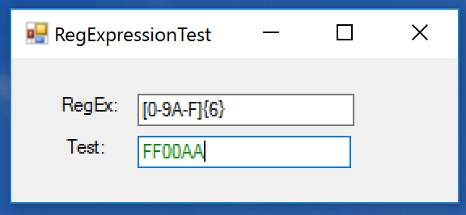
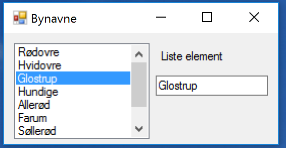

# Uge 7 - Observer mønster 
Vi skal i denne uge se på flere design mønstre. Et design mønster er en typisk måde at organisere sit program for at opnå en eller anden atråværdig kvalitet i programmet. 

Som regel er det man går efter at gøre programmet mere robust over for ændringer.

Men den centrale ting i disse mønstre er at de fleste af dem er måder hvorpå de centrale udviklere hos Microsoft (.Net), Oracle (Java) og andre kan udvikle program biblioteker og frameworks som vi som program udviklere kan benytte os af. Ofte benytter disse biblioker sig af design mønste vi skal følge for at få vores programmer til at virke.

Vi kommer til at bruge tre gange på forskellige designmønstre.

## Forberedelse & læsestof
Den oprindelige bog "Design patters - Elements of Reusable Software" af Gamma, Helm, Johnson og Vlissides udkom i 1994. Det er efter min mening stadig den bedste bog om disse mønstre da den indeholder de bedste design råd om hvornår og hvordan de skal bruges og hvornår man skal lade være. Den bygger på eksempler i C++ og Smalltalk, der ikke mere er i udbredte  brug.

Nettet er fuld af sider der forklarer alle disse mønstre, og der er skrevet mange bøger der viser eksemplerne i andre sprog, Java, Ruby, C#, Phyton....

Jeg vil forelå at I kikker i følgende:

- Case study: [Kapitel 2 fra den oprindelige bog](DP-Extract.pdf)

Når I undervejs får behov for at slå design mønstrene op kan jeg anbefale:

- Codeproject
  - [Part 1 - Creational Design Patterns](https://www.codeproject.com/articles/430590/design-patterns-of-creational-design-patterns)
  - [Part 2 - Structural Design Patterns](https://www.codeproject.com/articles/438922/design-patterns-of-structural-design-patterns)
  - [Part 3 - Behavioral Design Patterns](https://www.codeproject.com/articles/455228/design-patterns-of-behavioral-design-patterns)
- [Tutorialspoint](https://www.tutorialspoint.com/design_pattern/)
- [Wikipedia](https://en.wikipedia.org/wiki/Software_design_pattern)

## Events og Delegates
Jeg har forsøgt mig med en [kort note om disse emner](observerNote.md).

## Øvelser på klassen

Jeg gennemgik denne på klassen den 30 marts. 
###[Min løsning er her](https://github.com/cphbusinessAUVidrProg/uge7RegExFromClass). 
Man kan som tidligere downloade den som zip fil ved den store grønne knap i højre side.

For at prøve at bruge observer og mediator mønstrene i praksis skal vi prøve at lave et forms program hvor man kan fjerne og tilføje event handlere.

For at kunne dette skal vi dog først have et program. Et ret simpelt forms program er illustreret her:

Ideen er at man i øverste textbox kan skrive et regulært udtryk, mens den nederse linje er den tekst man vil matche. Hvis der er et match er teksten grøn, mens hvis der ikke er et match er teksten rød. Denne rød/grøn test er knyttet til nederste textbox's TextChanged event.

#### opgave 1
Lav programmet som beskrevet ovenfor.

#### opgave 2
Lav en knap "live regex" som kan tilknytte samme funktion (der checker nederste tekst linje mod øverste regulære udtryk) til den øverste textbox's TextChanged event. Man tilføjer metoder til events med `+=`.

#### opgave 3
Lav kappen fra opgave 2 sådan at første tryk tilknytter som i opgave 2, mens næste tryk fjerner metoden fra event listen. Man fjerner metoder fra events med `-=`. 

   

## Øvelser til næste gang
Øvelsen går ud på at få lidt rutine med at bruge forms og events. Øvelsen indeholder et ret stort element af at finde konkret programmerings information på nettet.

Vi skal bruge en liste (ListBox) og en TextBox for at få følgende lille form:

Altså en liste med bynavne. Hvis man vælger et element fra listen skal bynavnet vises i textboxen, og hvis man retter bynavnet skal det rettes i listen.

