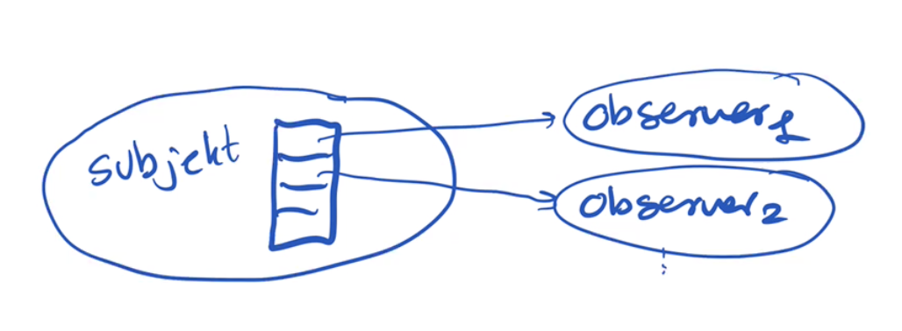

# Observer og mediator
Det generelle problem man ønsker at løse med observermønsteret er at et objekt (den observerende) er afhængig af tilstanden på et andet objekt (kaldet subjektet).

Istedet for periodevis at lade den observerende checke tilstanden hos subjektet lader man subjektet have en liste over de observanter som er interesseret i subjektets tilstand.



Når subjektet ændrer tilstand kalder det en metode på hver observer for at fortælle at nu er der ændringer som observeren måske er interesseret i.

Det er så op til observer objektet at hente de informationer den har brug for. Dette sker typisk ved at læse properties på subjektet, eller gennem metodekald på subjektet.

Det ærketypiske eksempel på observer mønsteret er at subjektet er et tekstbox objekt i windows forms, mens observeren er vores program.

I C# understøttes observer mønsteret gennem **events** og **delegates**.

Et event den liste som subjektet bruger til at holde styr på hvem der skal kaldes i tilfælde at tilstandsændringer. 
Ofte er det sådan at et subjekt kan ændre sig på mange måder, og derfor kan der være mange event lister for et enkelt subjekt.

I eksemplet med et tekstfelt, så er dette nogle af de events der findes.

- TextChanged
- Resize 
- GotFocus
- MouseHover

The [actual list is rather long](https://msdn.microsoft.com/en-us/library/system.windows.forms.textbox_events(v=vs.110).aspx).

In most of the code you will write you will not yourself write events, but just use existing events. Or in other words, subjects are typically part of program libraries and user interface frameworks, and not part of application programs. 

On the other hand, we as application programmers will very often subscribe to existing events.

The typical way we use this in our applications is:

```csharp 
private void currencyTextBox_TextChanged(object sender, EventArgs e)
{
   try
   {
      // Convert the text to a Double and determine if it is a negative number.
      if(double.Parse(currencyTextBox.Text) < 0)
      {
         // If the number is negative, display it in Red.
         currencyTextBox.ForeColor = Color.Red;
      }
      else
      {
         // If the number is not negative, display it in Black.
         currencyTextBox.ForeColor = Color.Black;
      }
   }
   catch
   {
      // If there is an error, display the text using the system colors.
      currencyTextBox.ForeColor = SystemColors.ControlText;
   }
} 
// Code copied from MSDN
//https://msdn.microsoft.com/en-us/library/system.windows.forms.control.textchanged(v=vs.110).aspx
```

However, somewhere in the initialization code which is generated and maintained by visual studio (in the InitializeComponent() method):

```csharp
currencyTextBox.TextChanged 
	+= currencyTextBox_TextChanged;
```

The `TextChanged`is an event. One can add subscribers to an event using the operators `+=`. On the right side of the `+=` we say which method to call when the event happens. 

**Notice:** It is not the naming convention that makes C# call the TextChanged method, but the fact it the method as added to the event inside the `InitializeComponent()` method.

## Delegates
På samme måde som vi ikke kan gemme en tekst i en heltalsvariabel, så kan man ikke komme vilkårlige metoder på en event. I eksemplet ovenfor med TextChanged eventet kan man kun registrere en event metode der tager to parametre (objekt og EventArgs).

På samme måde som en variabel skal have en type, således skal events også have en type. Typen på events kaldes delegater. Et eksempel på en delegat typer er:

```csharp
public delegate void EventHandler(object sender, EventArgs e);
```
Her erklæres EventHandler som navnet på en type metoder der tager to parametre og ikke returnerer noget.

Inde i TextBox klassen er eventet `TextChanged` erklæret som:

```csharp
public event EventHandler TextChanged;
```

Her står altså at man til eventet `TextChanged` kun kan knytte metoder der passer med typen `EventHandler`.

### Lidt C# historie
Events og delegater stammer fra før C# havde lambda udtryk og type parametre. Idag ville man kunne erklære TextChanged som:

```csharp
public event Action<object, EventArgs> ModernTextChanged;
```

Ligeledes vil kan man idag putte lambda udtryk på events direkte:

```csharp
currencyTextBox.TextChanged 
	+= (sender, args) => { ... kode der skal udføres ...};
```
Men visual studio arbejder altså stadig med delegater.


