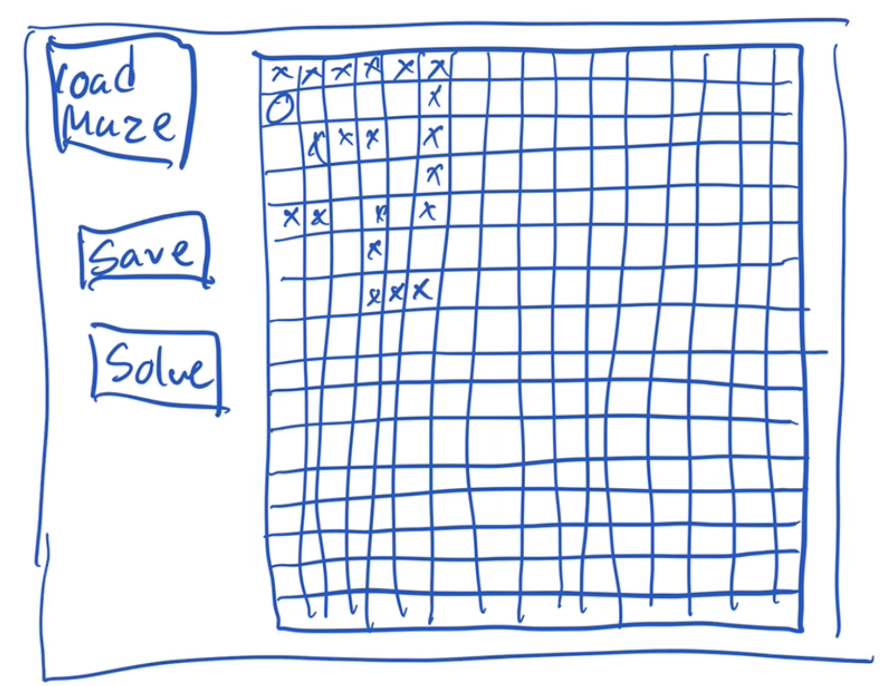
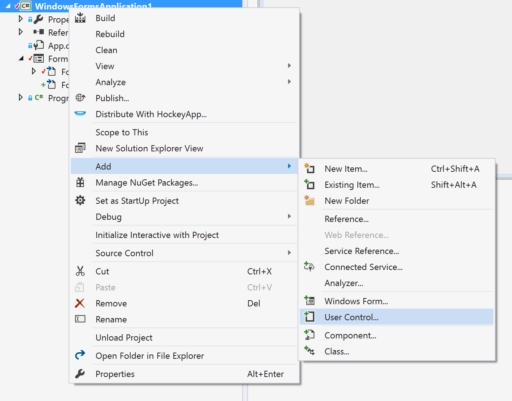
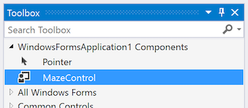
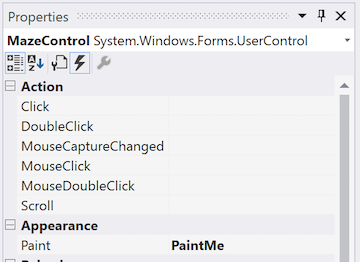

# Making a user control
If we want to include an element into a windows form application which is not part of the standard controls (TextBox, Label, ListBox etc.), one can make your own control - called a **UserControl**.

In our case, we want to be able to draw a maze, and edit it on the screen. 

A mockup of the form and control could be something like this:



The likelyhood of finding a control we can use for this is not very likely. So we will make our own.

There is some support for building user controls in Visual Studio, so this is part C# programming and part Visual Studio clicking.

### Step 1
First make a new windows form project, and add perhaps the three buttons "Load", "Save" and "Solve", leaving room for the Maze to the right.

### Step 2
The first step is to create a skeleton (not much code) user control.

Right clicking the solution, selecting add, should give you an option for selecting "User Control":



Visual Studio will then prompt you for a name, I called it MazeControl.

### Step 3
After you have added the control you need to rebuild the solution.

### Step 4
After the solution has been rebuild, the new control should be part of the tool box, at the very top.



Drag the MazeControl to the form.

### Step 5
Next we want to draw the grid. At first we will simply draw a 11 by 11 grid.

You do not call a method to draw the grid, you make a method which will draw the grid when the paint event happens. Select the MazeForm and in the properties select "Events" (marked by a lightning symbol).

In the Appearance category add a method under "Paint".



In the MazeControl you should now get a method:

```csharp
private void mazeControl1_Paint(object sender, PaintEventArgs e) {
	e.Graphics.DrawEllipse()// Continue your code here
}
```
## Interlude - Graphics and Pen
The principle of drawing in windows forms is that one draws on an object of type **Graphics** using an object of type **Pen**. The Graphics is roughly the piece of the screen which is the User Control.

A pen is created as `new Pen(Color.red)`(or what color you chose).

The graphics has a (large) number of methods for drawing various figures, in particular rectangles, ellipses, and lines. Remember that a circle is a special kind of ellipse.


