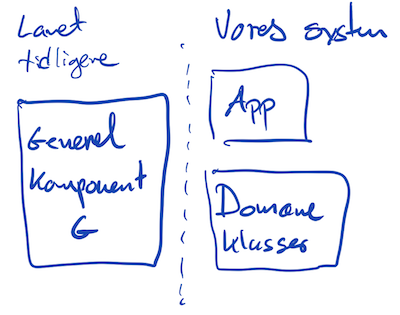

# Singleton, Prototype & Factory
Disse mønstre handler alle om at lave objekter. Som med alle mønstre bliver din software ikke bedre at at man bruger dem for at bruge dem. Alle software mønstre giver ekstra kompleksitet mod tilgengæld at give ekstra fleksibilitet.

Dog er der også nogle af dem der repræsenterer gode tricks som det er værd at kende. 

Jeg vil kort gennemgå tre mønstre der har med objekt skabelse at gøre. 

### Singleton
Nogle gange er man interessert i at der kun laves en instans af en klasse. Ud over vittigheder som Julemanden (som der kun er en af), så bruges Singleton som det objektorienterede svar på hvordan man stiller enkelt objekter til rådighed i hele programmet.

I både C# og Java benytter man sig af statiske metoder og felter til at opnå at der kun laves en instans.

I en del systemer, så findes der en klasse der hedder `Application` - som indeholder metoder og tilstand der kan bruges til at finde ud af hvor på maskinen programmet kører, hvilken bruger der har startet det mv. Der er kun en Application (set fra programmets eget synspunkt) og det er ikke meningen at programmøren skal kunne lave flere instancer inde fra programmet selv.

Normalt når vi har lavet nye instancer ud fra en klasse gør vi det med `new MyClass()`. Når vi skal have fat i instancen for `Application`gør vi det med `Application.Instance()`.

Hvis vi vil lave en klasse `MySingleton` så følger man denne skabelon:

```csharp
public class MySingleton {
	private static MySingleton instance; // husk singleton
	public static MySingleton Instance(){
		if ( instance == null ) { // der er ikke en instans
			instance = new MySingleton();
		}
		return instance();
	}
}
```

Nu kan vi få fat i singleton instansen ved `MySingleton.Instance()`. Første gang vi kalder `Instance()` vil der blive oprettet et nyt objekt, og herefter vil det allerede oprettede objekt blive returneret ved kald til `Instance()`. 

Som koden er ovenfor, er der ikke noget der forhindrer en i bare at lave sin egen instans ved blot at skrive `new MySingleton()`. Men der er et trick med dette (som også kan laves i både C# og Java). Man laver en privat konstruktør. Den fulde kode for MySingleton beliver så:

```csharp
public class MySingleton {
	private static MySingleton instance; // husk singleton
	public static MySingleton Instance(){
		if ( instance == null ) { // der er ikke en instans
			instance = new MySingleton();
		}
		return instance();
	}
	private MySingleton(){
	}
	
	// Andre felter og metoder...
}
```

### Prototype
I nogle situationer kopierer man eksisterende objekter i stedet for at lave nye objekter. For at det kan lade sig gøre skal objektet typisk indeholde en `Clone()` der laver et nyt objekt hvor alle felter (eller et udvalg af disse) får deres værdier fra det oprindelige objekt.

Det nyttigt hvis man har nogle objekter med mange felter som det vil være tungt at sætte værdier ind i.

Man skelner mellem Shallow (overfladisk) og Deep Clone. Typisk vil et objekt have referencer til andre objekter. Hvis det er en _Deep Clone_ vil man også klone de objekter der refereres til. Ved en overfladisk kloning vil originalen og klonen referere til de samme objekter. Begge dele kan være nyttigt.

En Prototype er egentlig bare et objekt man let kan finde og så klone.
Nogle tegne værktøj giver mulighed for at man kan vælge dele af sin tegning som en skabelon som så kan være tilgængelig i en skabelon menu. Når man så vil bruge den trækker man den ind på tegnefladen hvor der så laves en klon som man så kan rette videre i.

### Factory
Dette er lidt et mønster med chrom og højglans polering.

Situationen opstår når man vil lave nogle generelle programmer med minimum to delsystememer.



For at bygge vores system har vi brug for en generel komponent G som er lavet af nogle dygtige udviklere for at løse et problem der er svært at løse godt, og de har så lavet en løsning som vi gerne vil bruge.

Det som denne komponent gør er blandt andet at den holder styr på instanser af diverse klasser. I tegningen har jeg valgt at kalde de klasser som vi skal have styr på for domæne klasser fordi domænet (altså hvad handler vores system om) næsten altid ligger i vores system, og ikke i det der er lavet tidligere.

Vi skifter nu synsvinkel fra vores system, og over på hvilke udfordringer dem der tidligere har lavet det generelle system står overfor.

1. De skal kunne bygge datastrukturer der kan holde styr på klasser de endnu ikke kender.
2. De skal kunne lave instanser af klasser de endnu ikke kender.

For at løse 1. har vi set på _Generics_, altså at man kan give en type med som parameter - f.eks. i `List<Coordinate>`. Nogle gange foreskriver det generelle system også at vi skal implementere et interface sådan at det generelle system kan antage noget om hvordan vores domæne klasser ser ud.

Inde i det generelle system kan der derfor være variable som har interface typer,  så vi kan sende vores objekter ind i det generelle system.

```csharp
// Generelt system
public void include(ILovelyInterface li){
	// handle the li object
}

public interface ILovelyInterface{
	...
}
```
```csharp
// Our system
GenSyst.include( ourObj );
...
class OurObject : ILovelyInterface{
...
}
```

Men det løser kun emne 1.

Inde i det generelle system kan man ikke løse problem 2, da man ikke

* kan lave instanser ud fra et interface 
* ved jo ikke hvilken klasse der skal bruges (idet vores klasser var endnu ikke skrevet da det generelle system blev lavet)

**Det er dette andet problem som factory løser.**

Ideen er at man i det generelle system, ud over at have et `ILovelyInterface`, og så har et `ILovelyInterfaceFactory`. Dette interface har så en metode `Create()`:

```csharp
interface ILovelyInterfaceFactory {
	ILovelyInterface Create();
}
```

Når vi så skal bruge det, så skal vi implementere begge interfaces.

```csharp
// Generelt system
ILovelyInterfaceFactory factory;
public void setFactory(ILovelyInterfaceFactory fac){
	factory = fac;
}

... 
// Somewhere in the code where a new instance is needed
ILovelyInterface li = factory.Create();

...

public interface ILovelyInterface{
	...
}

interface ILovelyInterfaceFactory {
	ILovelyInterface Create();
}
```
```csharp
// Our system
GenSyst.setFactory( new OurObjectFactory() );
...
class OurObject : ILovelyInterface{
...
}

class OurObjectFactory : ILovelyInterfaceFactory {
	public ILovelyInterface Create()	{
		return new OurObject();
	}
}
```

Og for at slå krølle på det hele historien, så implementerer man ofte factories som singulære da der kun er brug for et.

## Kommentar
Man skal virkelig passe på ikke at gå amok med disse mønstre! Mange af dem er lavet specielt for at løse problemer der har at gøre med at lave generelle løsninger og mønstrene gør bare ens eget program mindre gennemskueligt.

Men man skal ofte forstå disse mønstre for at kunne bruge de generelle løsninger som en del af sit eget program, og det er derfor tit nødvendigt at kunne sætte sig ind i disse mønstre.

